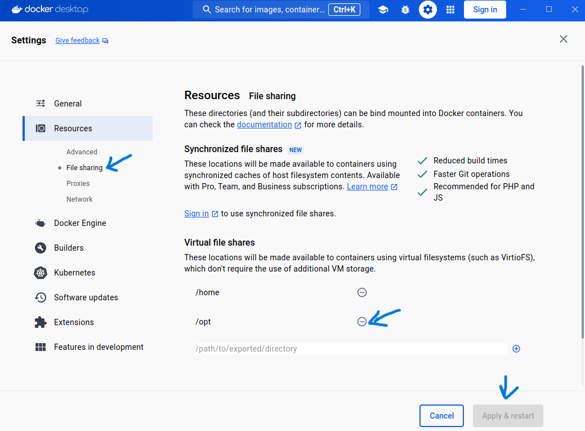

# Linux Dev Installation

Basic step explains in Haneda installation works also on native Ubuntu 22.04 LTS but **Containers cannot be managed from Docker Desktop UI** This is inconvenient for development purpose because developers use UI to easily check the health of the container, shell into containers, and etc. Use the following step to allow containers to be managed with Docker Desktop.

## Why Docker Desktop doesn't see my containers, images, volumes?

T-ONE installation uses `sudo` command. Linux uses different Docker context when using `sudo docker ...` It's required to change docker context when using `sudo` to docker desktop's default context `docker-linux`

## How to change root docker context?
1. Open terminal
1. List all contexts as root.
    ```bash
    sudo docker context ls
    ```
    You will notice only one context named `default`
1. Check docker context of the current
    ```bash
    docker context ls
    ```
    1. You will see 2 contexts 1. `default` and 2. `docker-linux`
    1. Take notes of the host name of the `docker-linux` context. In my case, it was __host://unix:///home/tsuite/.docker/desktop/docker.sock__ 
1. Create new docker context as root
    ```bash
    sudo docker context create --docker host=[[PREVIOUS_HOST_NAME]] docker-linux
    ```
1. Double check contexts as root.
    ```bash
    sudo docker context ls
    ```
    This time you should expect extra context that we just created as `docker-linux`

## Container didn't start due to mounting problem
1. Go to Docker Desktop
1. Open Setting
1. Resources > File Sharing > add `/opt` Virtual file share

1. Restart the computer. For safety sake.