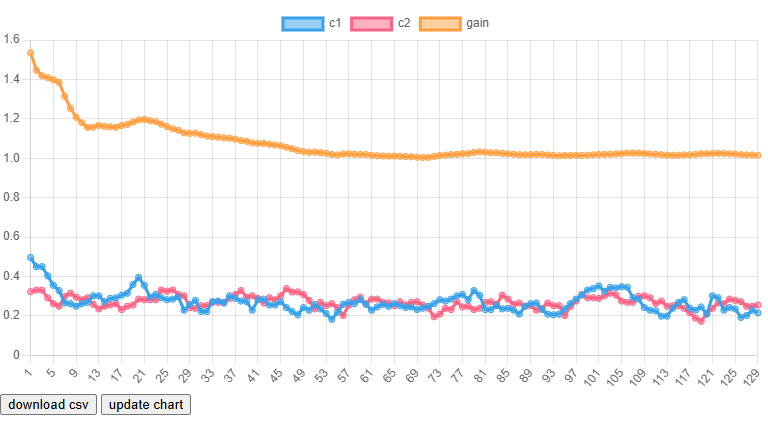
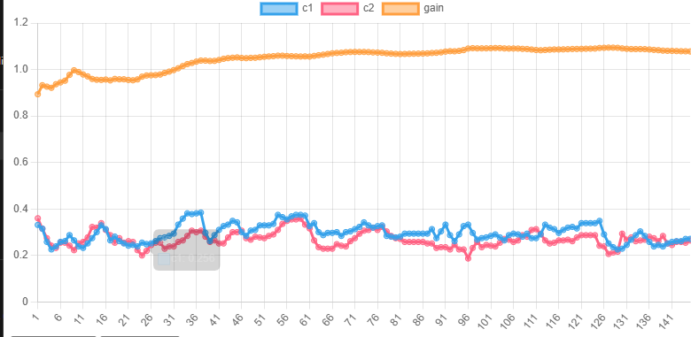

# Test javascript object allocation performance

These a long standing belief that memory allocation costs performance. This sketch is to proof / dis-proof such belief -- whether such belief is still relevant in Javascript. To get the insight, how much effort we should spend on optimizing the object allocation.

Experiment setup:
1. Assume jobs that run on high frequency -- mouse move event. This event is triggered at about 100FPS or 10ms.
1. Choices that we have when the event is triggered:
    A - new Quaternion() for temporary calculation
    B - Reuse globally allocated Quaternion for temporary calculation
1. Since the above step tooks so little time, we do it for 1e4 repetitions, so that the cpu time is significant & measurable

## Experiment result

1. Depends on how you look at. Most of the runs global allocation yields +10% performance at 1e6 allocations per seconds.

1. Once we start varying the number of allocations, the performance gain changes. More allocation rates, less gain (differences). I suppose this results are impacted by numbercial precision in time measurement. More allocations -> longer it takes -> more precise time measurement -> less gain.

1. Inconclusive test1 and test2

## Conclude

1. Differences are insignificant (varying between -5% to +10%) at 1mil allocations per second. In real world, we rarely allocate so many objects in a second. If we do, we might need to rethink why it's needed.

1. Cost of memory allocation isn't as high as we might think in Javascript. When we need to weight such optimization against 'readability', readability of the code prevails.

1. If there's no readability to be lost, it's always better to reuse / allocate less memory.