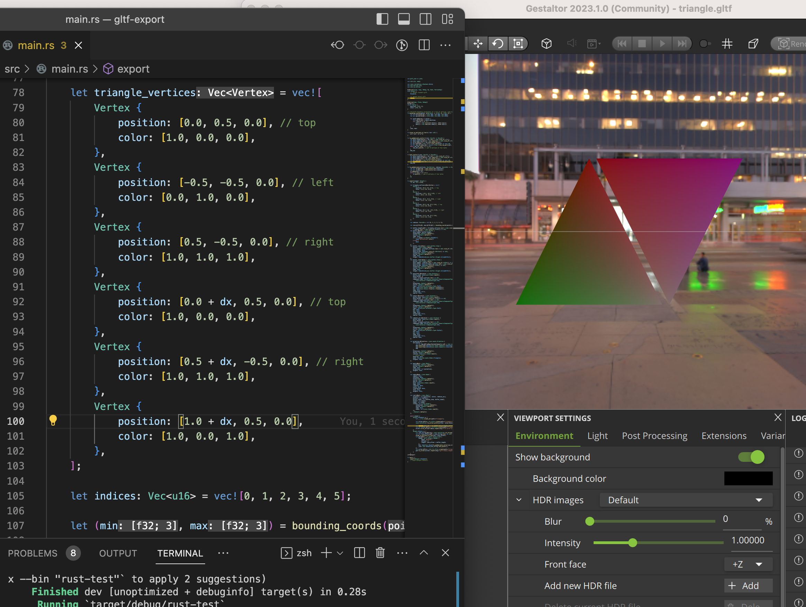

# GLTF Exporter Example in Rust

This is an extension of example from [gltf-rs library](https://github.com/gltf-rs/gltf/blob/main/examples/export/main.rs). In the original example, it doesn't explain how to use vertex indices to draw triangle.

[This reference](https://riccardoscalco.it/blog/a-gltf-triangle/) provide a good explanation on how json file in Gltf works. I follow the explanation but implemented in Rust.

## Example Screenshot

